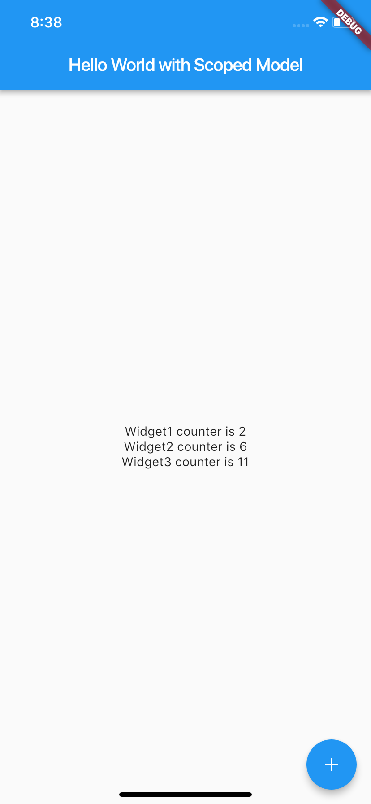

# scoped_model_hello_world

Example of Flutter's [scoped_model](https://pub.dartlang.org/packages/scoped_model), showing a simple list of widgets that react to updates of our scoped model state.

We show a very contrived example here but it's mean to be as simple as possible. We have three widgets that all rely on the same state. They are simple stateless widgets yet can easily receive updates of state that resides in a central place, our scoped model.

As the user taps the button at the bottom, our scoped model is updated and three widgets receive those updates. 

